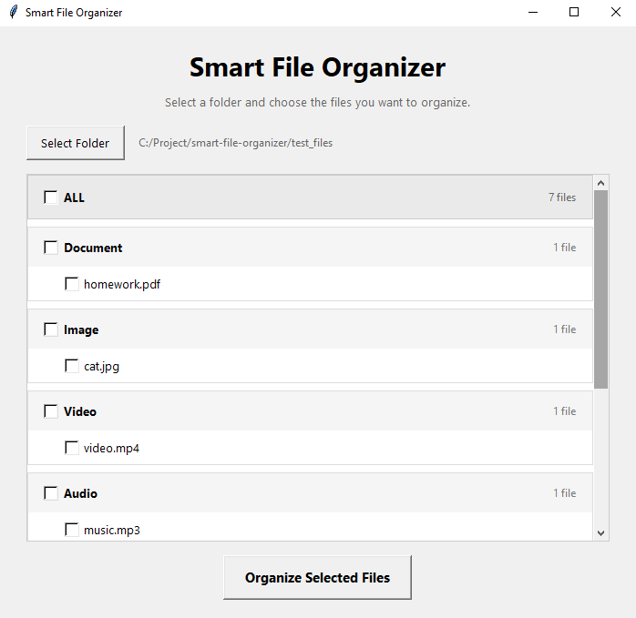
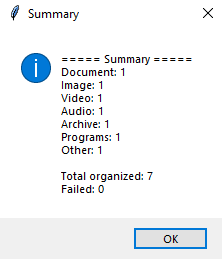

# Smart File Organizer

A Python desktop application that automatically organizes files into categories based on their file types.

## Features

- Automatically detects and organizes files
- Supports multiple file extensions
- Classifies files into Documents, Images, Videos, Audio, Archives, Programs, and Other
- Provides a graphical user interface (GUI) using Tkinter
- Allows users to select folders using a folder picker
- Displays files in a clean category-based interface
- Allows users to select individual files before organizing
- Allows users to select or deselect an entire category
- Includes an ALL option to select or deselect every file
- Automatically updates category and ALL selection states
- Hides categories that contain no files
- Supports scrolling through large file lists
- Asks for confirmation before moving selected files
- Automatically creates category folders
- Prevents duplicate filenames by automatically renaming files
- Handles file-moving errors without crashing the program
- Handles empty folders safely
- Shows an organization summary by category
- Reports successfully organized and failed files
- Supports uppercase and lowercase file extensions

## Screenshots

### File Selection



### Organization Summary



## How It Works

1. Select a folder to organize.
2. The program scans the files inside the selected folder.
3. Each file is classified based on its file extension.
4. Only categories containing files are displayed.
5. Select individual files, categories, or use ALL to select everything.
6. Click **Organize Selected Files**.
7. Confirm the operation.
8. Selected files are moved into their corresponding category folders.
9. A summary displays the organization results.

## Categories

- Documents
- Images
- Videos
- Audio
- Archives
- Programs
- Other

## How to Run

### Windows Executable

Download and run:

`Smart File Organizer.exe`

No Python installation is required.

### Run with Python

Make sure Python is installed, then run:

```bash
python gui.py
```

## Built With

- Python
- pathlib
- Tkinter
- PyInstaller
- Git
- GitHub

## What I Learned

Through this project, I learned about:

- Python file system operations
- Working with `pathlib`
- Functions and reusable code
- Lists and dictionaries
- File extension classification
- Error handling with `try/except`
- Building graphical interfaces with Tkinter
- Working with dynamic GUI elements
- Managing checkbox states with `BooleanVar`
- Creating scrollable interfaces
- Handling duplicate filenames safely
- Git and GitHub version control
- Packaging a Python application as a Windows executable with PyInstaller

## Version 1.1

Version 1.1 introduces a new file selection interface.

Users can now:

- Select individual files
- Select all files inside a category
- Select all detected files at once
- See only categories that contain files
- Scroll through large file lists
- Organize only the selected files

## Status

✅ Version 1.1